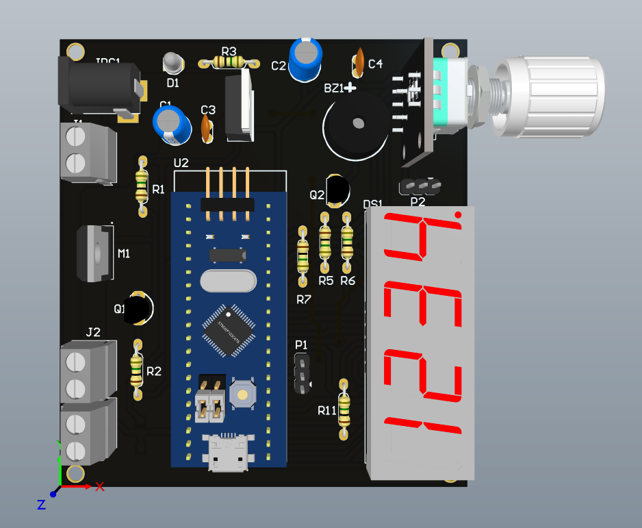
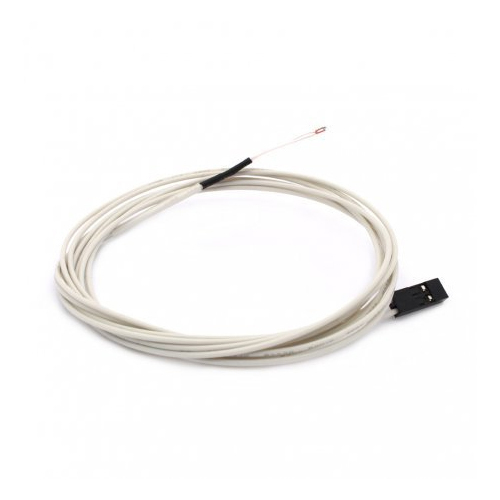

# Simple temperature PID control project
This is a project for Application Electronic cource at my university. The purpose of this project is to control temperature of a small heating block with a 12V/40W heater and 100k NTC thermistor. These components are used in a 3D printer at my laboratory.

# Usage 
The board is designed with Altium Designer

  

## Out of board components

  
  
    

As we can see from above, there are 3 out of board components needed for this project:

* Heating block
* 12V/40V 3D rinter heater
* 100k Ohm NTC thermistor

# Contributing
Pull requests are welcome. For major changes, please open an issue first to discuss what you would like to change.

Please make sure to update tests as appropriate.

# License
[MIT](https://choosealicense.com/licenses/mit/)